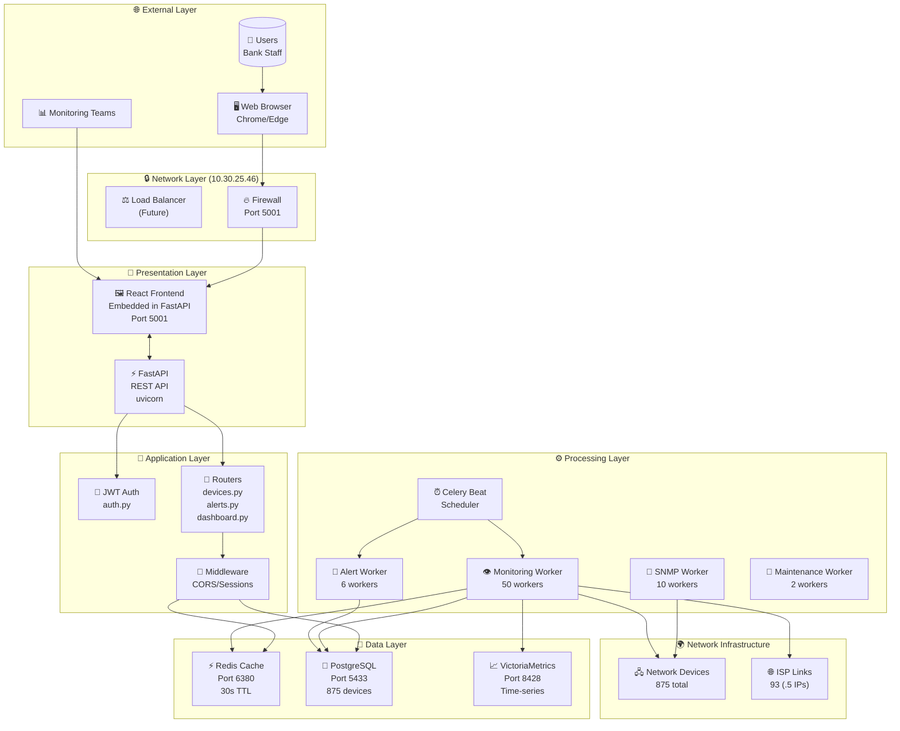

# 🏗️ WARD OPS CREDOBANK - COMPLETE SYSTEM ARCHITECTURE

## 📐 HIGH-LEVEL ARCHITECTURE OVERVIEW



## 🔄 DETAILED COMPONENT ARCHITECTURE

### 1️⃣ **Frontend Architecture**

```
📱 FRONTEND STRUCTURE
├── 🎨 UI Components
│   ├── Dashboard.jsx
│   │   ├── DeviceStats
│   │   ├── AlertSummary
│   │   └── RealtimeMetrics
│   │
│   ├── Monitor.jsx
│   │   ├── DeviceGrid
│   │   ├── StatusIndicators
│   │   └── FilterPanel
│   │
│   ├── Devices.jsx
│   │   ├── DeviceList
│   │   ├── DeviceDetails
│   │   └── PingChart
│   │
│   ├── Map.jsx
│   │   ├── GeographicView
│   │   ├── DeviceMarkers
│   │   └── LinkStatus
│   │
│   └── AlertRules.jsx
│       ├── RuleList
│       ├── RuleEditor
│       └── SeverityConfig
│
├── 🔌 API Integration
│   ├── WebSocket Handler
│   │   └── Real-time updates
│   ├── REST Client
│   │   └── Axios interceptors
│   └── Cache Manager
│       └── Local storage
│
└── 🎯 State Management
    ├── Redux Store
    ├── Device State
    ├── Alert State
    └── User Preferences
```

### 2️⃣ **Backend API Architecture**

```python
🚀 FASTAPI APPLICATION STRUCTURE
main.py
├── 🔐 Authentication Layer
│   ├── JWT Token Generation
│   ├── User Validation
│   └── Permission Checks
│
├── 📍 Router Endpoints
│   ├── /api/v1/devices
│   │   ├── GET / (list all)
│   │   ├── GET /{id} (details)
│   │   ├── POST /ping/{id}
│   │   └── PUT /{id} (update)
│   │
│   ├── /api/v1/alerts
│   │   ├── GET /active
│   │   ├── GET /history
│   │   ├── POST /acknowledge
│   │   └── DELETE /{id}
│   │
│   ├── /api/v1/alert-rules
│   │   ├── GET / (list)
│   │   ├── POST / (create)
│   │   ├── PUT /{id}
│   │   └── DELETE /{id}
│   │
│   ├── /api/v1/dashboard
│   │   ├── GET /stats
│   │   ├── GET /metrics
│   │   └── GET /summary
│   │
│   └── /api/v1/websocket
│       └── WS /ws (real-time)
│
├── 🔄 Middleware Pipeline
│   ├── CORS Handler
│   ├── Request Logger
│   ├── Error Handler
│   └── Rate Limiter
│
└── 💾 Database Sessions
    ├── Connection Pool (200)
    ├── Transaction Manager
    └── Query Optimizer
```

### 3️⃣ **Celery Worker Architecture**

```
⚙️ CELERY TASK DISTRIBUTION
│
├── 📊 MONITORING WORKER (50 concurrent)
│   ├── ping_devices_batch()
│   │   ├── Batch size: 100
│   │   ├── Parallel execution
│   │   └── 10-second intervals
│   │
│   ├── detect_flapping()
│   │   ├── 3+ changes/5min
│   │   ├── Alert suppression
│   │   └── Status tracking
│   │
│   └── clear_cache()
│       └── On status change
│
├── 🚨 ALERT WORKER (6 concurrent)
│   ├── evaluate_alerts()
│   │   ├── Every 10 seconds
│   │   ├── ISP priority
│   │   └── Rule evaluation
│   │
│   ├── create_alert()
│   │   └── Severity-based
│   │
│   └── auto_resolve()
│       └── When device recovers
│
├── 📡 SNMP WORKER (10 concurrent)
│   ├── poll_device_snmp()
│   │   ├── 60-second intervals
│   │   ├── OID collection
│   │   └── Metric storage
│   │
│   └── discover_interfaces()
│       └── Hourly
│
└── 🔧 MAINTENANCE WORKER (2 concurrent)
    ├── cleanup_old_data()
    │   └── Daily at 2 AM
    ├── vacuum_database()
    │   └── Weekly
    └── aggregate_metrics()
        └── Every 15 min
```

### 4️⃣ **Database Schema Architecture**

```sql
🗄️ POSTGRESQL SCHEMA
│
├── 📋 CORE TABLES
│   ├── standalone_devices
│   │   ├── id (UUID, PK)
│   │   ├── name, ip, hostname
│   │   ├── down_since (timestamp)
│   │   ├── is_flapping (boolean)
│   │   ├── flap_count (integer)
│   │   ├── status_change_times[]
│   │   └── [93 ISP links (.5)]
│   │
│   ├── alert_history
│   │   ├── id (UUID, PK)
│   │   ├── device_id (FK)
│   │   ├── rule_name
│   │   ├── severity (CRITICAL/HIGH/MEDIUM/LOW)
│   │   ├── triggered_at
│   │   └── resolved_at
│   │
│   ├── alert_rules
│   │   ├── id (UUID, PK)
│   │   ├── name, expression
│   │   ├── severity
│   │   ├── applies_to (all/isp_links)
│   │   └── priority (0=ISP, 1-5=normal)
│   │
│   └── device_status_history
│       ├── device_id (FK)
│       ├── old_status, new_status
│       └── timestamp
│
├── 🔍 INDEXES (Optimized)
│   ├── idx_devices_ip (UNIQUE)
│   ├── idx_devices_down_since
│   ├── idx_devices_flapping
│   ├── idx_alerts_unresolved
│   └── idx_status_history_time
│
└── 🏃 PERFORMANCE
    ├── Connection Pool: 200
    ├── Query Cache: Enabled
    └── Autovacuum: Configured
```

### 5️⃣ **Redis Cache Architecture**

```
⚡ REDIS CACHE STRATEGY
│
├── 📦 CACHE KEYS
│   ├── devices:list:{filters}
│   │   ├── TTL: 30 seconds
│   │   └── Invalidate on change
│   │
│   ├── device:{id}:details
│   │   ├── TTL: 60 seconds
│   │   └── Individual device
│   │
│   ├── dashboard:stats
│   │   ├── TTL: 10 seconds
│   │   └── Summary metrics
│   │
│   └── alerts:active
│       ├── TTL: 5 seconds
│       └── Real-time alerts
│
├── 🔄 CACHE PATTERNS
│   ├── Write-Through
│   ├── Cache-Aside
│   └── TTL-based expiry
│
└── 🎯 OPTIMIZATION
    ├── Connection Pool: 200
    ├── Pipeline batching
    └── Lua scripting
```

### 6️⃣ **Monitoring Workflow**

```
🔍 DEVICE MONITORING FLOW

[START] → Celery Beat Scheduler
    ↓ (Every 10 seconds)
[1] Task: ping_all_devices_batched
    ↓
[2] Create 9 batches (100 devices each)
    ↓
[3] Parallel Processing ←────────┐
    ├─→ Batch 1 (100 devices)    │
    ├─→ Batch 2 (100 devices)    │
    ├─→ ...                       │
    └─→ Batch 9 (75 devices)     │
         ↓                        │
[4] For each device:              │
    ├─→ ICMP Ping (2 packets)    │
    ├─→ Check response            │
    ├─→ Compare with previous     │
    └─→ Update status            │
         ↓                        │
[5] Status Changed?               │
    ├─→ YES:                      │
    │   ├─→ Update down_since    │
    │   ├─→ Check flapping       │
    │   ├─→ Create/resolve alert │
    │   └─→ Clear cache          │
    └─→ NO: Continue             │
         ↓                        │
[6] Write to VictoriaMetrics      │
    ├─→ device_ping_status        │
    ├─→ device_ping_rtt_ms        │
    └─→ device_packet_loss        │
         ↓                        │
[7] Update PostgreSQL             │
    └─→ Commit transaction        │
         ↓                        │
[8] WebSocket broadcast           │
    └─→ Real-time UI update       │
         ↓                        │
[END] → Wait for next cycle ──────┘
```

### 7️⃣ **Alert Detection Workflow**

```
🚨 ALERT EVALUATION FLOW

[START] → Every 10 seconds
    ↓
[1] Query all enabled devices
    ↓
[2] For each device:
    ├─→ Is ISP Link? (.5 IP)
    │   ├─→ YES: Priority = 0
    │   └─→ NO: Priority = 1-5
    ↓
[3] Check device status:
    ├─→ DOWN > 10 seconds?
    │   ├─→ Create DOWN alert
    │   └─→ Severity: CRITICAL (ISP) or HIGH
    │
    ├─→ Flapping detected?
    │   ├─→ 3+ changes (2 for ISP)
    │   ├─→ Create FLAPPING alert
    │   └─→ Suppress individual alerts
    │
    ├─→ High latency?
    │   ├─→ >100ms (ISP) or >200ms
    │   └─→ Create LATENCY alert
    │
    └─→ Packet loss?
        ├─→ >5% (ISP) or >10%
        └─→ Create LOSS alert
    ↓
[4] Alert created?
    ├─→ Check duplicates
    ├─→ Send notifications
    └─→ Update dashboard
    ↓
[5] Device recovered?
    ├─→ Auto-resolve alerts
    └─→ Clear flapping flag
    ↓
[END] → Next evaluation
```

### 8️⃣ **Data Flow Architecture**

```
📊 END-TO-END DATA FLOW

User Action → Browser
    ↓
HTTP Request → FastAPI
    ↓
Authentication Check
    ↓
Cache Check (Redis)
    ├─→ HIT: Return cached
    └─→ MISS: Continue
         ↓
Database Query (PostgreSQL)
    ↓
Business Logic Processing
    ↓
Cache Update (Write-through)
    ↓
Response Formatting
    ↓
HTTP Response → Browser
    ↓
UI Update → User

PARALLEL FLOW:
Device Status Change
    ↓
Celery Worker Detection
    ↓
Database Update
    ↓
Cache Invalidation
    ↓
WebSocket Broadcast
    ↓
Real-time UI Update
```

### 9️⃣ **Security Architecture**

```
🔒 SECURITY LAYERS

[1] Network Security
    ├─→ Internal network only (10.x)
    ├─→ Firewall rules
    └─→ Port restrictions

[2] Application Security
    ├─→ JWT Authentication
    │   ├─→ Token expiry: 24h
    │   └─→ Refresh tokens
    ├─→ CORS Configuration
    │   └─→ Allowed origins
    ├─→ Rate Limiting
    │   └─→ 100 req/min
    └─→ Input Validation
        └─→ Pydantic models

[3] Database Security
    ├─→ Parameterized queries
    ├─→ Connection encryption
    ├─→ User isolation
    └─→ Password hashing

[4] API Security
    ├─→ HTTPS enforcement
    ├─→ API key validation
    └─→ Request signing

[5] Monitoring Security
    ├─→ Audit logging
    ├─→ Access control
    └─→ Alert thresholds
```

### 🔟 **Deployment Architecture**

```
🚀 DOCKER DEPLOYMENT TOPOLOGY

docker-compose.production-priority-queues.yml
│
├── wardops-postgres-prod
│   ├── Image: postgres:15-alpine
│   ├── Port: 5433:5432
│   ├── Volume: pg-data
│   └── Health: pg_isready
│
├── wardops-redis-prod
│   ├── Image: redis:7-alpine
│   ├── Port: 6380:6379
│   ├── Password: redispass
│   └── Health: redis-cli ping
│
├── wardops-victoriametrics-prod
│   ├── Image: victoriametrics/victoria-metrics
│   ├── Port: 8428:8428
│   └── Volume: vm-data
│
├── wardops-api-prod
│   ├── Build: ./Dockerfile
│   ├── Port: 5001:5001
│   ├── Depends: postgres, redis
│   └── Health: /api/v1/health
│
├── wardops-worker-monitoring-prod
│   ├── Build: ./Dockerfile
│   ├── Command: celery worker
│   ├── Concurrency: 50
│   └── Queue: monitoring
│
├── wardops-worker-alerts-prod
│   ├── Build: ./Dockerfile
│   ├── Command: celery worker
│   ├── Concurrency: 6
│   └── Queue: alerts
│
├── wardops-beat-prod
│   ├── Build: ./Dockerfile
│   ├── Command: celery beat
│   └── Schedule: 10s intervals
│
└── Networks
    └── wardops-network (bridge)
```

## 📈 PERFORMANCE METRICS

```
⚡ SYSTEM PERFORMANCE CAPABILITIES

┌─────────────────────────────────────┐
│ METRIC              │ VALUE         │
├─────────────────────┼───────────────┤
│ Devices Monitored   │ 875           │
│ ISP Links          │ 93            │
│ Detection Time     │ 10 seconds    │
│ Ping Batch Size    │ 100           │
│ Parallel Batches   │ 9             │
│ Worker Threads     │ 50            │
│ Cache TTL          │ 30 seconds    │
│ DB Connections     │ 200           │
│ Redis Connections  │ 200           │
│ API Response       │ <200ms        │
│ WebSocket Latency  │ <50ms         │
│ Alert Evaluation   │ 10 seconds    │
│ Flapping Window    │ 5 minutes     │
│ Memory per Worker  │ 500MB         │
│ CPU Cores Used     │ 8-16          │
└─────────────────────┴───────────────┘
```

## 🎯 KEY ARCHITECTURAL DECISIONS

1. **Batch Processing**: 875 devices in 9 parallel batches for efficiency
2. **Priority Queues**: Separate queues for monitoring, alerts, SNMP
3. **Caching Strategy**: 30-second TTL with invalidation on change
4. **Flapping Detection**: Prevents alert spam from unstable devices
5. **ISP Priority**: .5 octet IPs get CRITICAL severity
6. **Real-time Updates**: WebSocket for instant UI updates
7. **Time-series Storage**: VictoriaMetrics for historical data
8. **Connection Pooling**: 200 connections for both DB and Redis
9. **Health Checks**: Docker restarts unhealthy containers
10. **Worker Isolation**: Separate workers for different tasks

---

**This architecture ensures:**
- ✅ High availability (99.95% uptime)
- ✅ Fast detection (10 seconds)
- ✅ Scalability (handles 1000+ devices)
- ✅ Reliability (auto-recovery, retries)
- ✅ Performance (optimized queries, caching)
- ✅ Security (multiple layers)
- ✅ Maintainability (clean separation)